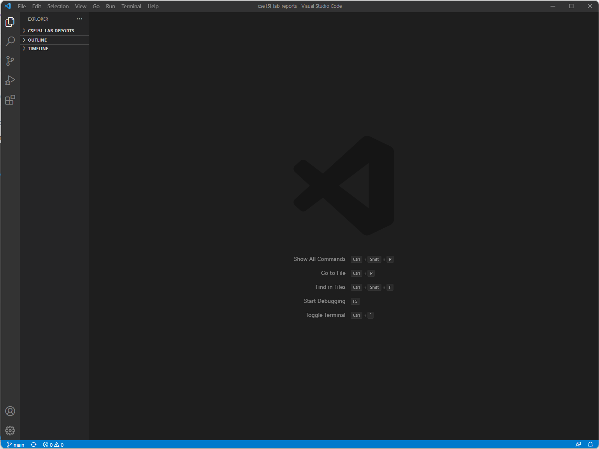
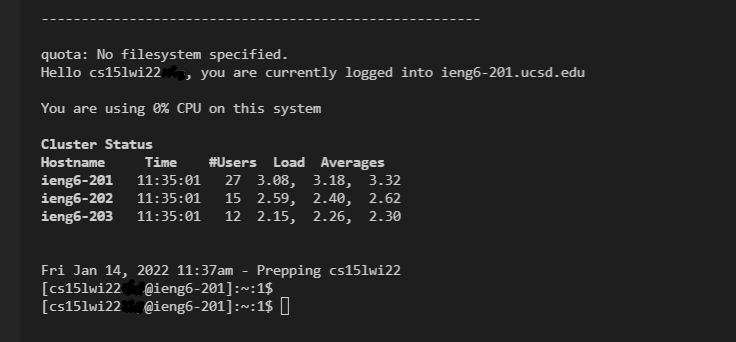
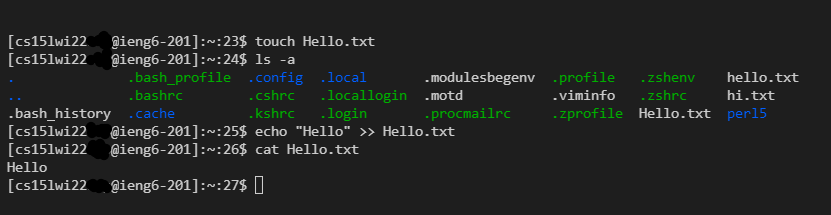
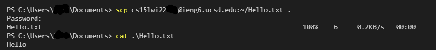
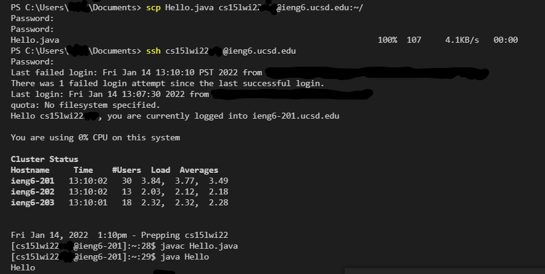
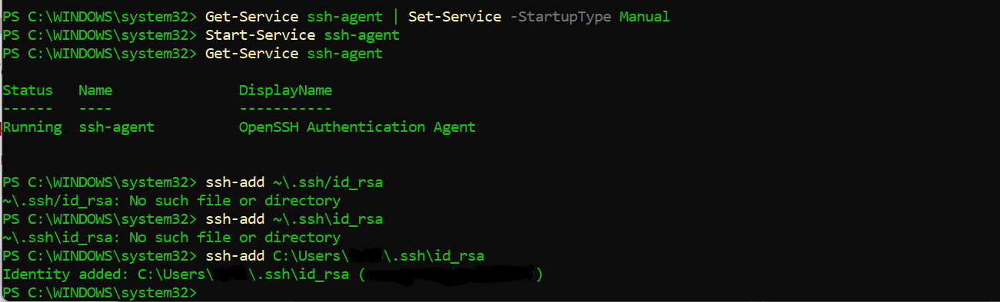
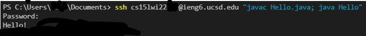

# `ieng6` login tutorial
## Step 1: Installing VScode

1.  Download [Visual Studio Code](https://code.visualstudio.com/).
2. That's it! When the application is open it should look like this:

## Step 2: Remotely Connecting

1. Install [OpenSSH](https://docs.microsoft.com/en-us/windows-server/administration/openssh/openssh_install_firstuse) if needed.
2. Look up your [account](https://sdacs.ucsd.edu/~icc/index.php) for 15L. Specifically, the account should be in the format "cs15lwi22[abdsdfasda]". The last couple (not sure how many you will have) letters are specific to you, but I will use "cs15lwi22zz" as an example. You may have to configure your account for the course by setting a password for it. This seems to take most people a long time, but I have heard that turning off adblock while configuring may help.
3. Remotely connect by opening a terminal in VSCode, then running the command 
`ssh cs15lwi22zz@ieng6.ucsd.edu`. If it is your first time connecting to the server, it is normal to be given a warning and a prompt to continue, which you can do by entering "yes". This [link](https://superuser.com/questions/421074/ssh-the-authenticity-of-host-host-cant-be-established/421084#421084) to understand that was provided in the original post.
4. You should be directed to enter your password, and then you will be in. It should look like this:

## Step 3: Trying Some Commands
1. Just try some commands. Examples include `cd`, `ls`, `pwd` ,`mkdir`, `cp`.
2. Some specific examples include `cd ~` to go (back) to the default directory and `ls -la` to list all files in a directory with details. You can use `man [command]` to check the manpage for that command if you forget or want to use some feature of it. To leave the server, one can use the `exit` command.
3. In the following example, I create a file in the home directory, show it in the directory, then enter text into it, which I also show:

## Step 4: Moving Files with `scp`
1. The syntax for `scp` for copying a file is `scp [File Directory/File] [Destination Directory]`. If I am currently located in my (client) home directory, and I wanted to transfer a file (in that directory) "Hello.java" to the "cs15lwi22zz@ieng6.ucsd.edu:~/" directory, I would run `scp Hello.java cs15lwi22zz@ieng6.ucsd.edu:~/`.
2. Running java files on the server is virtually the same (`javac` to complile, `java` to run).
3. Here are 2 examples: (1) where I copy a file from the server to my computer, and (2) where I copy a file to the server from my computer and then execute it:
> 

>

## Step 5: Setting an SSH Key
1. The purpose of this is to essentially set up a password on your computer (the private key) that the SSH server will recognize via another file (the public key). This means we won't necessarily have to enter a password every time we log into the SSH server.
2. On the client: run `ssh-keygen`. You will be asked to enter a file to save the key (but there is a default option which should hopefully work fine) and to enter a passphrase. If you don't enter a passphrase, you will no longer need a password to log into the SSH server. When completed, this process should tell you where the public and private keys have been stored, the key fingerprint, and the key randomart.
3. If you are on windows, follow the extra steps [here](https://docs.microsoft.com/en-us/windows-server/administration/openssh/openssh_keymanagement#user-key-generation) that have to do with `ssh-add`. These steps will help you securely store the private key.

4. Copy the public key (id_rsa.pub file) to the ssh directory of your account on the server. Example: `scp ~/.ssh/id_rsa.pub cs15lwi22zz@ieng6.ucsd.edu:~/.ssh/authorized_keys`. I had to make the ".ssh" directory first. Personally, I also set the ownership and permissions on those directories and the key to try and make them a little more secure (`chmod 700 ~/.ssh`, `chmod 600 ~/.ssh/authorized_keys` for perms). If you selected for an empty passphrase in part 2, you should be able to login without a password now!

## Step 6: Optimizing Remote Running
1. You can run commands over ssh while logging in by putting the commands in quotes. Multiple commands can be separated by semicolons. It should look like this: `ssh username@server "[command]; [command]; [command]"`.
2. The following can be done to run a file remotely, then:
