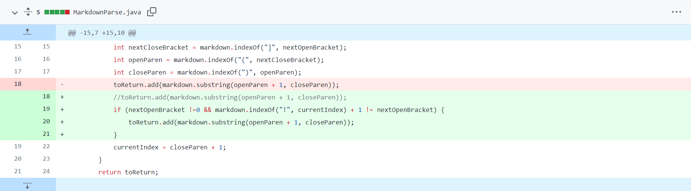
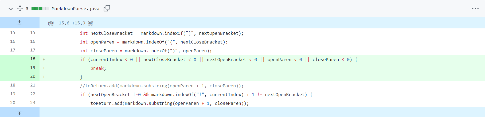
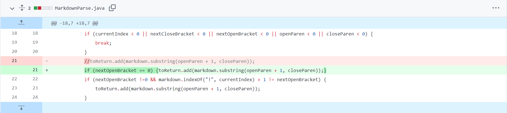

## Fix 1: Fixed issue with Image.md

[Image.md](https://github.com/okulkarni573/markdown-parse/blob/main/Image.md)

The failure inducing input is Image.md.

The symptom is that running the code on Image.md includes the image in output:
`[hi.jpg]`

The bug is that the code recognizes an image as a link- we fixed this by only adding the "link" (according to the previous version of the code) if it is not actually an image.

## Fix 2: Fixed issue with InfiniteLoop.md

[InfiniteLoop.md](https://github.com/okulkarni573/markdown-parse/blob/main/InfiniteLoop.md)

Failure-inducing input: InfiniteLoop.md

Symptom: The code wouldn't produce any output, but rather would endlessly run.

Bug: When there was no next instance of a parenthesis or bracket, the next index became -1, and the code kept looping through the file continuously. To prevent this, we break out of the loop if the index of a parenthesis of bracket falls under 0.
## Fix 2: Fixed issue with CharAfter.md

[CharAfter.md](https://github.com/okulkarni573/markdown-parse/blob/main/CharAfter.md)

Failure-inducing input: CharAfter.md

Symptom: Not printing out a link as it should, but instead printing an empty array:
`[]`

Bug: The fix made to Image.md was too restrictive and did not consider the case where the first open bracket was at index 0.