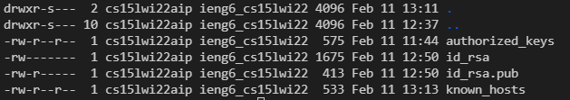

# Group Choice 2 - Setup Github Access from ieng6
## Screenshot 1

This screenshot shows the public key on my github account. I will soon show both the public and private keys as located on my user account.

## Screenshot 2

This screenshot shows the private and public keys on my user account. These are located in the .ssh directory.

## Screenshot 3

This screenshot shows the edit I made to the lab report remotely. It also shows me commiting and pushing this change from my ieng6 account.
