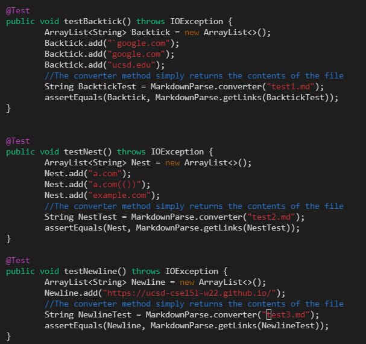
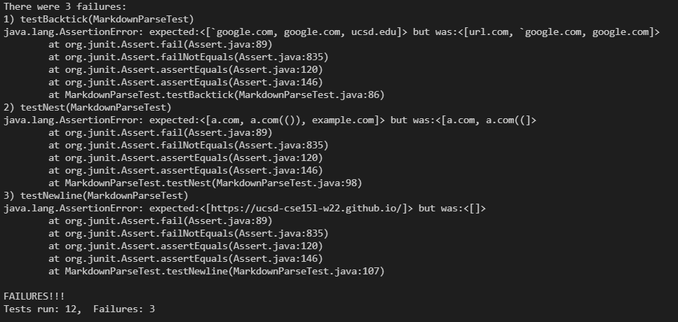
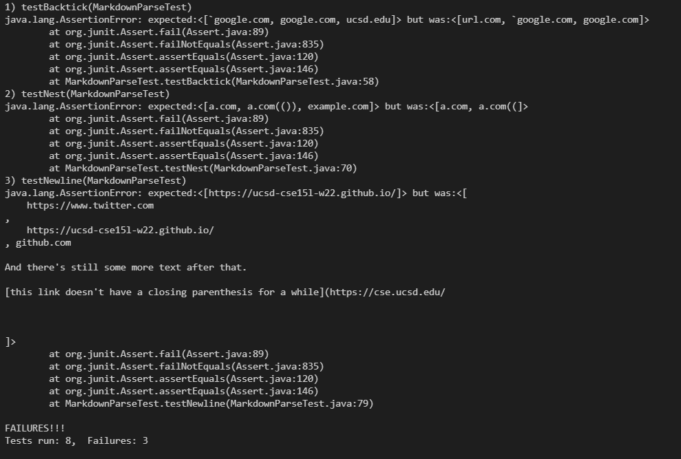

## Tests
I decided on the tests by running the examples through the CommonMark site. I looked at the links that showed up and the websites they linked to (I didn't discriminate on the basis of the existance of validity of the site though). Here are the tests for the 3 cases, in order. The valid links are the red strings (excluding the .md files):

## Reviewed implementation
All tests failed:

## My implementation
All tests failed:

Answers for each of the snippets:

1.  Yes, I think there is a relatively short solution. In effect we have to skip brackets  that occur between pairs of backticks. The same goes for parenthesis, except for the case where only the end parenthesis is in the backticks.

2. Some of the lines in he example may be easy to check, like checking for the last closed parenthesis (line 2), and checking for escape characters and skipping over the characters escaped (line 3). However, searching for nested links (line 1) could be more complicated because it involves checking for links within spaces like the open and closed parenthesis, which is more complicated than searching the first or last brackets.

3. I think this can be fixed through a short code change, involving searching if there is a line break somewhere in the link in order to invalidate the link if necessary.