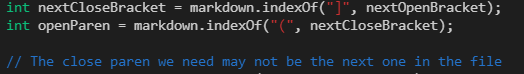

## Lab Report 5
In order to find the tests with different results, I used the script.sh file
  to generate text files for the results of 3 implementations over all tests.
  - pristineresults.txt corresponds to the implmentation from lab 10 using
    CommonMark. I used this file to check where my implementations were wrong.
  - results1.txt corresponds to the professor's markdown-parse implementation.
  - results2.txt corresponds to my markdown-parse implementation.

  I used diff to find where results1.txt and results2.txt were different
  initially to choose 2 tests, and then used sed to show how results1.txt and
  results2.txt differed with what they should be, and also what tests exactly
  they differed on.

## Test 1: 201.md

My implementation was correct but not the professor's. There is no link in 201.md

The bug is that the code does not check for any characters between the last
closed bracked "]" and first open parenthesis "(". The code finds the index of
the next "(" without checking for extra characters. Such a check between these
2 lines of code is a fix.

## Test 1: 194.md

Both implementations are incorrect. The link should be "my_(url)" but the
professor's implementation just says "url" and mine claims there is no link.

The bug in my implementation is that I don't check for the syntax that uses a
colon to define a link. As a result, I simply skip over the "(" as there are
extra characters between it and the "]". A fix is that I could check for a
colon first to determine how to check for a link before running the code below.
